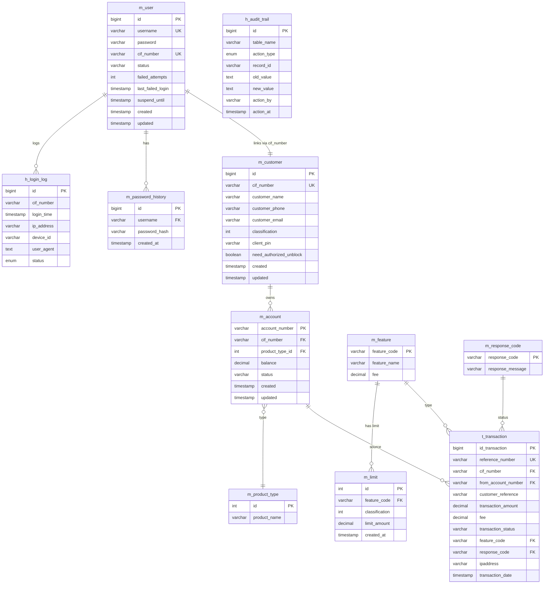

# CETAK BIRU ARSITEKTUR BASIS DATA APLIKASI MOBILE BANKING

> **Pendekatan:** CIF-Centric, Pemisahan Schema Otentikasi, dan Kepatuhan Standar Industri Perbankan (ISO 8583)
> **Platform Target:** MySQL / SQLyog
> **Tanggal Penyusunan:** 21 Mei 2026

---

## 1. Pendahuluan & Latar Belakang Arsitektur

Rancangan basis data ini fokus pada dua prinsip utama:
1. **Cross-Schema Security Isolation:** Pemisahan schema otentikasi (`authentication`) dan schema aplikasi bisnis (`dsi_mb_srd`). Ini memitigasi risiko kebocoran data akibat SQL Injection. Kredensial nasabah terisolasi dari data operasional harian.
2. **CIF-Centric (Customer Information File):** Menggunakan nomor CIF sebagai pengikat logis utama. Satu pengguna (login) terikat ke satu nomor CIF, yang dapat memiliki beberapa nomor rekening sekaligus tanpa merusak struktur relasi.

---

## 2. Entity Relationship Diagram (ERD)

Berikut adalah visualisasi relasi antar tabel menggunakan Mermaid.js. Lu bisa copy-paste kode di bawah ke [Mermaid Live Editor](https://mermaid.live/) buat dapet gambar HD-nya.



---

## 3. Spesifikasi Schema Final (Enterprise Ready)

### 3.1. Database: `authentication`
| Tabel | Fokus Bisnis |
| :--- | :--- |
| `m_user` | Kredensial login, status akun (ACTIVE/LOCKED), dan counter failed attempts. |
| `m_password_history` | Kepatuhan PCI-DSS: Mencegah penggunaan kembali password lama. |
| `h_login_log` | Audit Keamanan: Mencatat IP, Device ID, dan status setiap percobaan login. |

### 3.2. Database: `dsi_mb_srd`
| Tabel | Fokus Bisnis |
| :--- | :--- |
| `m_customer` | Golden Record nasabah (Profil Tunggal). |
| `m_account` | Data rekening (Multi-account). Terhubung ke `m_product_type`. |
| `m_product_type` | Master kategori produk (Tabungan, Giro, Deposito). |
| `m_limit` | Risk Management: Kontrol limit harian per-fitur dan per-kasta nasabah. |
| `m_feature` | Katalog fitur M-Banking dan konfigurasi biaya admin (fee). |
| `t_transaction` | Log mutasi finansial absolut. |
| `h_audit_trail` | Jejak audit internal untuk setiap perubahan data master. |

---

## 4. Business Logic & Security (Stored Procedures)

Sistem ini tidak hanya mengandalkan logic di level aplikasi (Java), tetapi juga memproteksi data di level database melalui:

### 4.1. `sp_login_user`
Prosedur otomatis untuk menangani proses login yang aman:
- **Validation:** Mengecek kecocokan username dan password.
- **Auto-Lock:** Jika salah password 3x berturut-turut, sistem otomatis mengubah status user menjadi `LOCKED`.
- **Attempt Counter:** Melacak jumlah kegagalan login secara *real-time*.

### 4.2. `sp_fund_transfer`
Logika inti transaksi finansial antar rekening:
- **Daily Limit Enforcement:** Validasi transaksi berdasarkan limit harian fitur dan kasta nasabah.
- **Atomicity:** Memastikan mutasi saldo pengirim dan penerima terjadi secara utuh (Atomic Transaction).
- **ISO 8583 Response:** Mengembalikan kode respon standar industri (00, 51, 61, 14, 99).

---

## 5. Panduan Sidang (Enterprise Standard FAQ)

1. **Kenapa dipisah dua database?**
   Isolation of Concerns. Data kredensial (`authentication`) tidak boleh tercampur dengan data operasional (`dsi_mb_srd`) untuk memitigasi dampak kebocoran data.
2. **Bagaimana integritas datanya?**
   Menggunakan `cif_number` sebagai **Logical Business Key**. Meskipun beda database, relasi tetap terjaga secara aplikasi dan audit.
3. **Bagaimana penanganan konkurensi saldo?**
   Transaksi keuangan menggunakan Engine **InnoDB** yang mendukung ACID (Atomicity, Consistency, Isolation, Durability) melalui `TRANSACTION` block.


---

## 6. Contoh Struktur Pembuatan Basis Data (DDL Snippet)

```sql
-- Database Authentication (Security isolation)
CREATE TABLE authentication.m_user (
    id BIGINT AUTO_INCREMENT PRIMARY KEY,
    username VARCHAR(50) UNIQUE NOT NULL,
    password VARCHAR(255) NOT NULL,
    cif_number VARCHAR(20) UNIQUE NOT NULL,
    status VARCHAR(20) DEFAULT 'ACTIVE',
    failed_attempts INT DEFAULT 0
) ENGINE=InnoDB;

-- Database dsi_mb_srd (Core Business)
CREATE TABLE dsi_mb_srd.m_customer (
    id BIGINT AUTO_INCREMENT PRIMARY KEY,
    cif_number VARCHAR(20) UNIQUE NOT NULL,
    customer_name VARCHAR(100) NOT NULL,
    classification INT DEFAULT 1,
    client_pin VARCHAR(255) NOT NULL
) ENGINE=InnoDB;

CREATE TABLE dsi_mb_srd.m_account (
    account_number VARCHAR(20) PRIMARY KEY,
    cif_number VARCHAR(20) NOT NULL,
    balance DECIMAL(15,2) DEFAULT 0.00,
    CONSTRAINT fk_acc_cust FOREIGN KEY (cif_number) REFERENCES m_customer(cif_number)
) ENGINE=InnoDB;
```

---

## 7. Kueri Operasional Lintas Database (Financial Mutation)

```sql
SELECT 
    u.username,
    c.customer_name,
    t.from_account_number AS rekening_sumber,
    t.customer_reference AS tujuan,
    f.feature_name AS jenis_transaksi,
    t.transaction_amount AS nominal,
    rc.response_message AS status_keterangan,
    t.transaction_date AS waktu_eksekusi
FROM authentication.m_user u
JOIN dsi_mb_srd.m_customer c ON u.cif_number = c.cif_number
JOIN dsi_mb_srd.t_transaction t ON c.cif_number = t.cif_number
JOIN dsi_mb_srd.m_feature f ON t.feature_code = f.feature_code
JOIN dsi_mb_srd.m_response_code rc ON t.response_code = rc.response_code
WHERE u.username = 'budi_hartono'
ORDER BY t.transaction_date DESC;
```

---

## 8. Panduan Sidang (FAQ)

1. **Kenapa denormalisasi di `m_customer`?**
   Untuk kecepatan respon. Join ke Core Banking itu mahal dan lambat. Denormalisasi berfungsi sebagai data cache lokal.
2. **Integritas data lintas database?**
   Dijaga via *Logical Business Key* (`cif_number`). Validasi dilakukan di level aplikasi sebelum data di-insert.
3. **Urgensi snapshot biaya di `t_transaction`?**
   Menghindari anomali historis jika tarif di `m_feature` berubah di masa depan.
